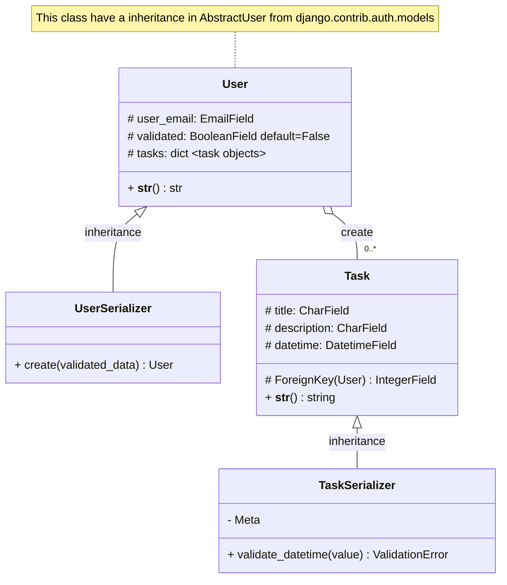
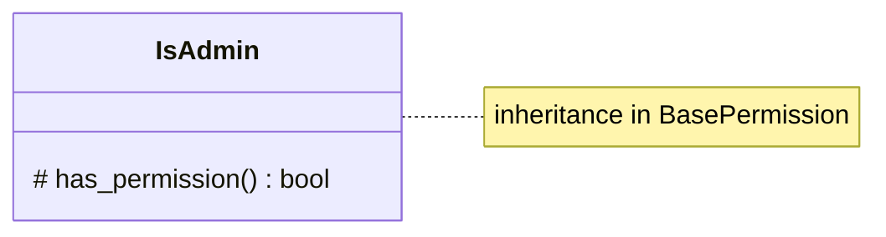
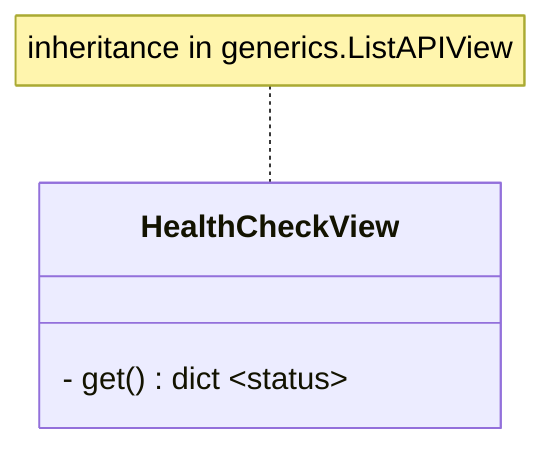
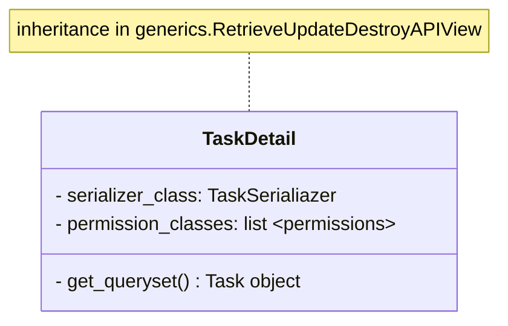
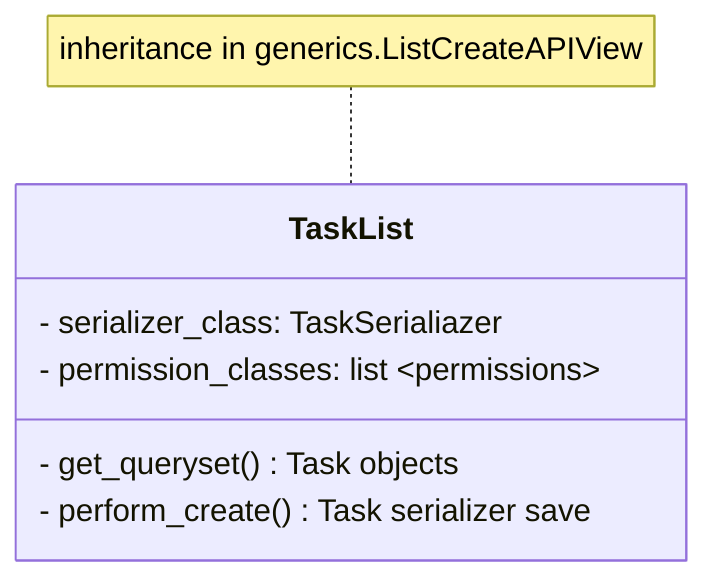
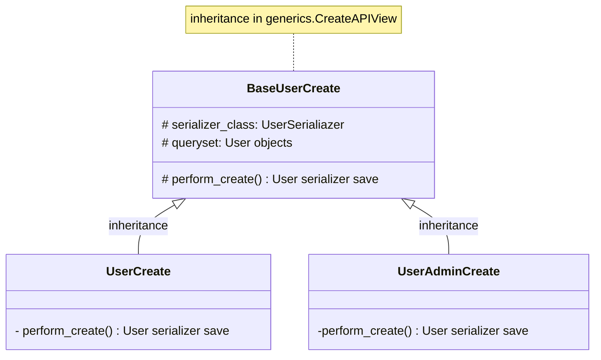
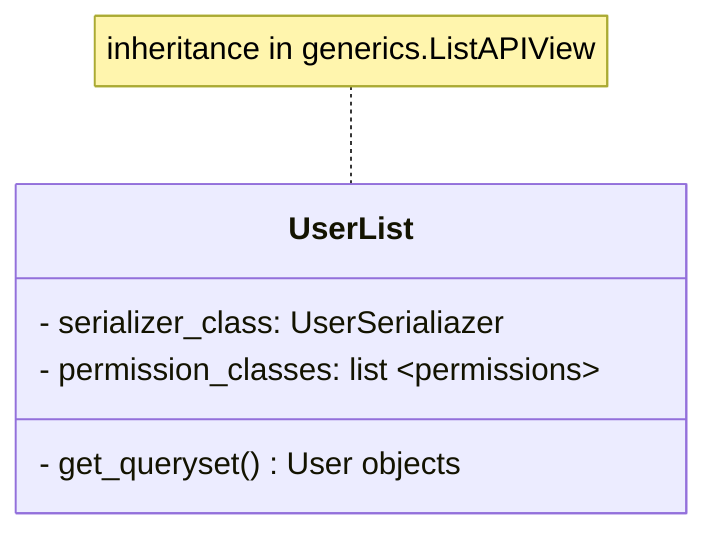
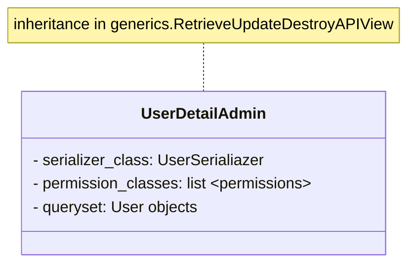
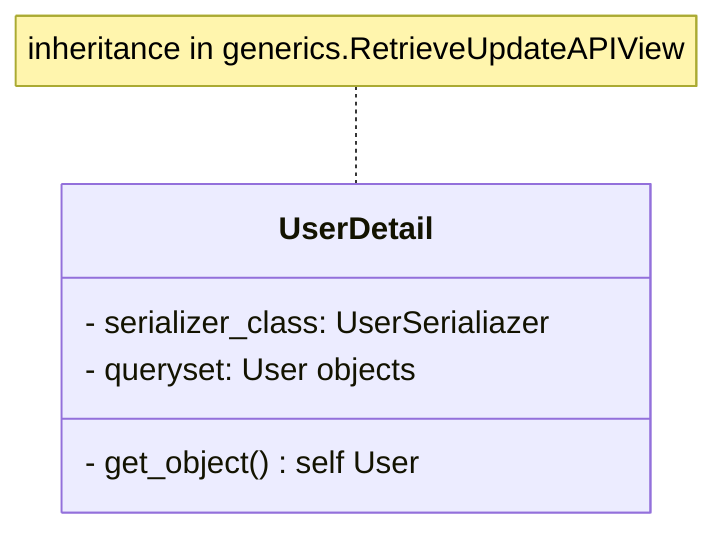
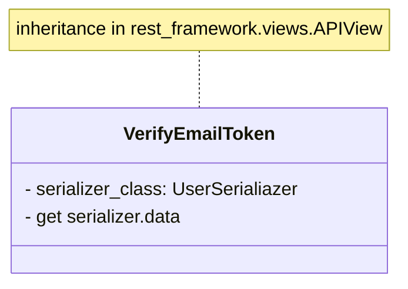

# 📅 A To-do List in a Calendar

This project is my first try to create an organized application, with documentation and good pratices. I've applied in this API concepts about clean code, RESTful API, PEP8 and PEP257.

## Hosting

I've hosted this project in render.com, because it's free and no need credit card. It's can be access in: <https://todo365.onrender.com/api/>

## DRF Swagger

Using drf-yasg I've created a swagger explaining any types of possible requests.

## Diagrams

Here are all the project diagrams, I tried to explain their functionalities and relationships.

### Models and Serializers Class Diagrams

### Custom Permission Class Diagram

### Views Class Diagrams

